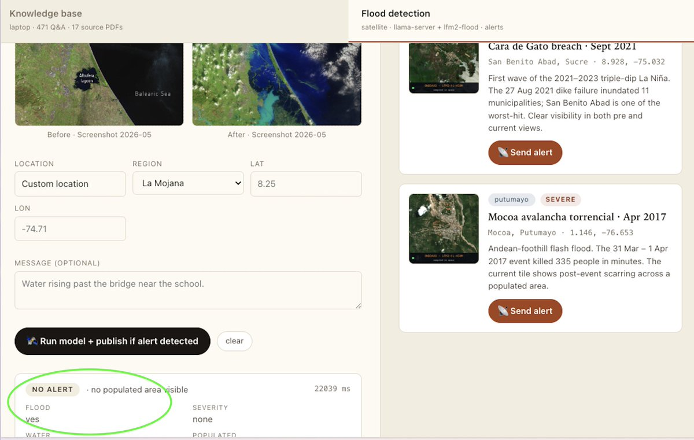
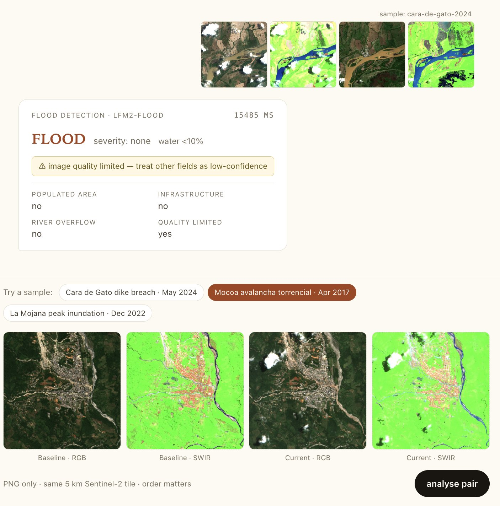

# WHY humaid

> **humaid: AI in orbit spots the flood, offline app on the ground tells each person what to do.**
> No internet, locally relevant, context-aware.

🎬 **Demo video:** <https://youtu.be/1LNs5D-6AbY>
🧵 **Build thread (24-hour hackathon log):** <https://x.com/jpmarindiaz/status/2052408206756905108>
🌐 **Live app:** <https://humaid.app/app>

---

## Two-liner

humaid puts a small AI on a satellite to spot the flood, sends a 200-byte alert to the ground, and unlocks a role-tagged, source-cited Q&A on a device that works without internet — **process the flood in space, answer the questions on the ground.**

---

## Problem — what real-world challenge does humaid address?

In a flood, the knowledge that would save lives already exists — in hundreds of pages of **UN OCHA**, government-entity, and **Red Cross PDFs** and incomprehensible **GIS dashboards** — but it **never reaches the people who need it**. Cell towers go down with the power, the internet drops, roads are cut, and the cloud-based dashboards everyone relies on become unreachable in the first 6–72 hours, exactly when the most actionable decisions get made by people already in the affected area.

Risk maps speak in GIS jargon a local-org president can't read; numerical alerts ("Río Putumayo 11.5 m") don't translate to "what do I do?"; satellite imagery processed in a data centre arrives days late. The result is that the same lessons get re-learned every La Niña cycle: **WASH gaps re-discovered, evacuation routes improvised, families separated**.

This is a **knowledge-delivery problem, not a knowledge problem** — and humaid is the rail to fix it, with prompt satellite-direct alerts and locally queryable knowledge bases backed by local models.

---

## Solution — how humaid works, step by step

humaid closes the planning-to-action gap with **three components that keep working when the network goes down**.

### 1. A small AI spots the flood from orbit

A fine-tuned vision model — **LFM2.5-VL-450M, ~450 MB** — runs *on the satellite itself*. It turns Sentinel-1/2 imagery into a 200-byte JSON flood alert, and downlinks the answer instead of the imagery. No cloud, no megabytes, no per-tile bill.

### 2. A community sync station receives the alert

A solar-tolerant Pi-class node at a school, clinic, or JAC. It catches the JSON over any low-bandwidth ground link and pushes notifications to nearby devices over local Wi-Fi — and pre-syncs the knowledge base whenever it has internet.

### 3. A local app translates the alert into role-specific actions

Tauri desktop / Android on the responder's laptop or *campesino*'s phone. **Ollama + Nomic embeddings + DuckDB** run on-device with **471 source-cited bilingual Q&A pairs**. The user picks their role once; the app surfaces what to grab, where to go, who to call — filtered for their role, phase (pre / event / post), and region (La Mojana wetland vs Putumayo Andean–Amazon).

---

## Why this matters for space-based compute specifically

The flood model lives on a satellite for reasons that **only make sense in that physics**:

- **Bandwidth is the bottleneck, not compute.** A Sentinel-2 tile is 5–20 MB. An LFM2-VL JSON output is 200 bytes. Downlinking the answer instead of the imagery is **five orders of magnitude less data** over the ground link — the difference between hundreds of alerts per orbit and one.
- **A CubeSat has ~5 W to play with.** A frontier model needs a data centre. The 450M-parameter quantized GGUF (245 MB backbone + 50 MB mmproj) is the largest thing that *fits* in orbit. Small models aren't a compromise here; **they're the only thing you can actually run.**
- **Above all: cost.** We need to **reduce the cost for humans to get the knowledge they need, when they need it.** On-orbit inference + offline ground retrieval together collapse the per-event cost-per-person from a cloud-API line item to ≈$0 marginal.

---

## Models we trained / published

| Artifact | Repo | What |
|---|---|---|
| **Fine-tuned flood model** | [`jpmarindiaz/lfm2-flood`](https://huggingface.co/jpmarindiaz/lfm2-flood) | LFM2.5-VL-450M fine-tuned for 4-image flood detection. Q4_0 GGUF + F16 mmproj + merged HF checkpoint. |
| **Flood-detection training data** | [`jpmarindiaz/flood-detection-pair-colombia`](https://huggingface.co/datasets/jpmarindiaz/flood-detection-pair-colombia) | 88 train + 22 eval 4-image (RGB+SWIR baseline / current) pair samples across 9 La Mojana / Putumayo flood events, with 7-key JSON labels. |
| **Knowledge-base Q&A** | [`jpmarindiaz/humaid-kb-colombia`](https://huggingface.co/datasets/jpmarindiaz/humaid-kb-colombia) | 589 bilingual (EN + ES) role-tagged Q&A pairs — 471 humanitarian + 118 project-meta — plus the prebuilt DuckDB index with Nomic embeddings inline. |
| **Base model on Ollama** | [`jpmarindiaz/lfm2.5-vl-450m`](https://ollama.com/jpmarindiaz/lfm2.5-vl-450m) | Easier interface to interact with the base LFM2 family alongside other local embedding models. Not a fine-tune; published for convenience of one-line `ollama pull`. |

---

## A surprise moment — generalisation outside the training distribution

A model fine-tuned **only on Colombia floods** correctly identified **the historical Valencia flood in Spain** as a flood. No alert was generated for it (different threshold logic) but the detection was right. Small models, well-grounded data, modest fine-tunes — they generalise more than you'd expect.

Try it yourself: <https://humaid.app/app>.

---

## What was the hardest part?

**Making a complete solution** rather than optimising specific models, and **conceptualising what's actually useful** for a specific domain: humanitarian aid. The architecture slowly emerged with multiple open-source tools and models talking to each other in a way that made sense for real people *once the problem was clear*. The technical part was not that difficult thanks to the cookbook examples — the hard part was deciding what to build, and what *not* to.

---

## What's been built

- ✅ Fine-tuned LFM2.5-VL-450M for flood detection — published on HF Hub
- ✅ 471-pair humanitarian knowledge base + 118-pair project-meta = 589 cited Q&A in DuckDB — published on HF Hub
- ✅ Public website with two live demos (KB chat + flood inference) at <https://humaid.app/app>
- ✅ Tauri desktop + Android client polling the website for alerts
- 🚧 Community-station daemon (solar-tolerant Pi-class hardware bring-up)
- 🚧 Sentinel-1 SAR retrofit (cloud-independent imagery — see [`finetune-flood/REPORT.md`](finetune-flood/REPORT.md))

---

## Forkability — humaid for *your* basin

humaid is open source and the architecture is **deliberately portable**:

- **Hazard-agnostic** — same satellite-VLM-onboard + JSON-alert + offline-Q&A pattern works for wildfires (proven by Liquid AI's wildfire-prevention cookbook), volcanic eruptions, landslides, severe weather.
- **Region-agnostic** — the role × phase × region matrix scales by adding region buckets. Atrato (Chocó), Andean Community of Nations (Ecuador, Peru, Bolivia), Mekong delta, Sundarbans — all natural extensions.
- **Language-agnostic** — same multi-agent Q&A pipeline operates over any source corpus in any language. Indigenous-language overlays are on the v2 roadmap.
- **Institution-agnostic** — works with national civil-protection agencies *or* NGO consortia *or* indigenous *cabildos* *or* multilateral programmes.

If you want to deploy a humaid for your basin, the build path is documented in [`knowledge-base/README.md`](knowledge-base/README.md#build-it-from-scratch--for-developers). Reach out — we want to hear who's trying it.
