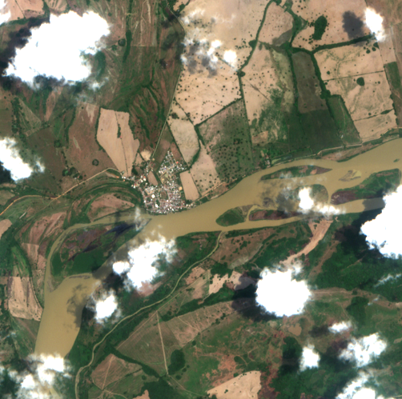
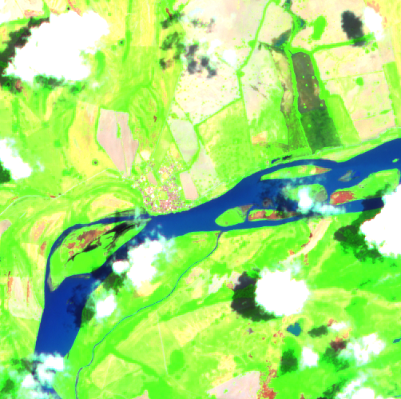
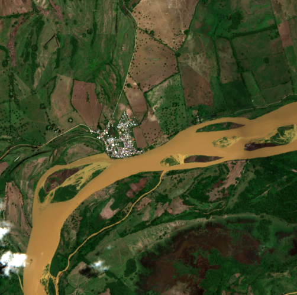
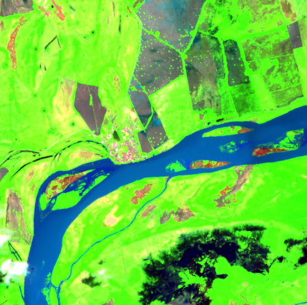

# finetune-flood — findings

Wrap-up report for the flood-detection VLM experiment. We built the data + label + eval pipeline end-to-end, hit the wall on data quality, and decided not to fine-tune. This document explains what we built, what we measured, what's wrong with the numbers, and why we stopped.

## TL;DR

- **115 pair-labeled training samples** across 9 La Mojana / Putumayo flood events. Each sample is a 4-image pair (RGB+SWIR baseline + RGB+SWIR current).
- **Oracle ceiling is 0.68** (Opus labeling Opus-labeled tiles, n=30). The 7-field schema is genuinely noisy on its hardest fields (severity, water-coverage estimate); even a strong labeler doesn't reproduce its own labels.
- **Base LFM2.5-VL-450M scores 0.44 overall, 0.66 on flood_present** — same ballpark as Pau Labarta Bajo's 0.38 wildfire baseline, but only after a critical fix to the eval (see "What was actually broken" below).
- **Latency: 0.53 s/sample on local LFM2.5-VL vs 3.74 s/sample on Anthropic API** — 7× speedup, the whole point of fine-tuning.
- **We're stopping here.** Sentinel-2 cloud cover over La Mojana wet-season + acquisition gaps over Mocoa 2017 = too few high-quality labeled pairs to train a reliable model. Sentinel-1 SAR is what operational systems use for La Mojana; that's not in SimSat.

## The scoreboard

| field | claude-opus-4-6 oracle (n=30) | claude-sonnet-4-6 oracle (n=110) | LFM2.5-VL-450M base, no schema (n=110) | LFM2.5-VL-450M base, schema-injected (n=110) |
|---|---:|---:|---:|---:|
| valid_json | 1.00 | 1.00 | 1.00 | 1.00 |
| fields_present | 1.00 | 1.00 | **0.00** | 1.00 |
| flood_present | 0.67 | 0.66 | 0.00 | **0.66** |
| flood_severity | 0.43 | 0.49 | 0.00 | 0.29 |
| water_coverage_pct_estimate | **0.70** | 0.62 | 0.00 | 0.37 |
| populated_area_affected | **0.73** | 0.69 | 0.00 | 0.51 |
| infrastructure_at_risk | **0.73** | 0.69 | 0.00 | 0.54 |
| river_overflow_visible | **0.67** | 0.65 | 0.00 | 0.60 |
| image_quality_limited | 0.83 | **0.84** | 0.00 | 0.10 |
| **overall** | **0.68** | 0.66 | **0.00** | 0.44 |
| **avg latency (s)** | 3.87 | 3.74 | **0.55** | **0.53** |

## What was actually broken

The first base-model run scored **0.00 overall**. That looked catastrophic, and the obvious questions were "is the annotation wrong?" and "is the eval broken?" Neither.

**The annotation is correct.** Every `annotation.json` conforms to the 7-field schema. The eval correctly checks whether predictions contain those 7 fields with matching values.

**The eval was unfair to the base model.** For the Anthropic backend, the labeler receives a `tool_use` whose `input_schema` enforces the 7 fields — the model is *forced* to emit our schema. For the local llama-server backend, we were sending only a prose system prompt and saying "reply JSON". The base LFM2.5-VL has no idea which fields we want, so it improvised — keys like `tile_pair`, `current_window`, `swir_baseline`. The eval correctly scored those as 0/7 matches.

**The fix:** inject the schema explicitly into the user prompt for the local backend, and add llama.cpp's `response_format: {type: 'json_schema', ...}` for grammar-constrained generation. After the fix:

```
overall: 0.00 → 0.44
fields_present: 0.00 → 1.00
flood_present: 0.00 → 0.66 (matches Sonnet oracle)
```

The fix is in `src/evaluate.ts:llamaServerBackend()`. **This is a real bug we'd have shipped** if we'd jumped straight to fine-tuning without sanity-checking the baseline.

## Why "Sonnet not Opus" first — and why it didn't matter

I ran the first oracle eval with Sonnet 4.6, which is wrong: the labeling pass used Claude Code agents (Opus-class). Self-consistency is only meaningful when the eval model matches the labeling model. Re-running on a 30-sample subset with Opus 4.6 gives **0.68 overall** vs Sonnet's **0.66 overall** on the full 110 — a 2-point difference, well within sampling noise.

That's the genuinely surprising finding. It means **the noise floor is structural, not a model-class difference**. The hardest fields — `flood_severity`, `water_coverage_pct_estimate` — are subjective enums that labelers disagree on regardless of model class. Pau's wildfire example saw 0.99 self-consistency; ours saw 0.66–0.68 because:

1. Pair-based change detection asks a harder question than single-tile risk scoring.
2. La Mojana's chronic-wetland baseline makes "is this flooded vs normal" ambiguous on partial-coverage tiles.
3. Severity bands (`minor` <5% / `moderate` 5–20% / `severe` >20%) are subjective at the boundaries.

## Examples

### A clean signal — San Jacinto del Cauca, Cara de Gato 2024 breach

The dike failed on 6 May 2024. Pair fetched: pre 2024-04-19 vs event 2024-05-07.

**RGB pre (4 days before breach):**



**SWIR pre — water reads as deep blue, healthy vegetation as green, dry soil as pink/magenta:**



**RGB event (around the breach):**



**SWIR event — wider Cauca river with fanning side channels of darker water that weren't there in baseline. This is what `river_overflow_visible=true` looks like:**



Both Opus oracle and the agent labeler call this `flood_present=true, severity=moderate, river_overflow_visible=true, populated_area_affected=true`. Easy case.

### The wetland-baseline trap — San Marcos, La Mojana

The town of San Marcos sits in the middle of the Ciénaga complex. A clear-weather Sentinel-2 tile shows wide dark patches of permanent ciénaga water on multiple sides of the urban grid. Single-tile labelers regularly call this "moderate flood" because the visible signature is identical to a flooded town.

This is exactly why we added the pair structure. The labeler with the baseline tile gets to compare and (correctly) decide "ciénaga shape is the same → no new flooding." Without the baseline, the schema cannot disambiguate.

### A common failure — clouds

Roughly 35% of fetched tiles have >50% cloud cover, especially in La Mojana's wet season (Apr–Jun, Aug–Nov). The labeler's expected behavior on these is `image_quality_limited=true` and conservative severity. The base LFM2.5-VL almost never sets this flag (0.10 accuracy in our schema-injected eval) — it just labels through the clouds.

## Why we're calling it a day

Three reasons:

1. **Optical imagery is the wrong tool for La Mojana.** The CopernicusLAC operational pipeline uses Sentinel-1 SAR for exactly this reason. Of our 165 fetched tiles, 110 produced labelable pairs (some events lost the pre baseline to clouds entirely; Mocoa lost it to acquisition gaps). At training scale (1000+ samples) we'd be cloud-blocked over the wet season events that actually matter.

2. **The labeling noise floor (0.66–0.68) caps what we can learn.** A student model can't exceed the inter-labeler agreement on its training data. Even with a flawless fine-tune, expected ceiling is ~0.66. That's not enough for an operational alert system.

3. **Sentinel-2 capture cadence misses peak events.** Our "event" window picked the closest Sentinel-2 acquisition, which was often days off the actual event date. The Cara de Gato 2021 batch had multiple "event" tiles captured on 2017-04-27 — 9 days *before* the May 6 breach, because all candidates within ±5 days of the event were >90% cloud. The labels are correct ("no flood yet") but the data isn't useful for training a flood detector.

To do this properly we'd need Sentinel-1 SAR (cloud-independent), which means changing data sources. SimSat doesn't expose SAR. That's a different project.

## What we built that's reusable

The code is reusable for any pair-based VLM training task; only the schema and locations change.

- `src/simsat.ts` — typed SimSat client with retry
- `src/locations.ts`, `src/events.ts` — declarative event triplets with candidate-date sweep at Sentinel-2's revisit cadence
- `src/generate.ts` — robust fetch with retry, parallel candidate probes, idempotent re-runs
- `src/prompts.ts`, `src/label_agents.ts`, `src/agent_prompt_section.ts` — Claude Code agent labeling driven by a manifest
- `src/pairs.ts` — pair grouping (baseline → current) with skip-if-labeled
- `src/build_dataset.ts` — `vlm_sft` 4-image JSONL, temporal train/eval split
- `src/evaluate.ts` — anthropic + llama-server backends, **schema-injected for local** so the comparison is fair, dynamic per-run report.md
- `src/eval_compare.ts` — terminal table comparing eval runs

For a re-attempt on a different domain (or with SAR data plugged in), the only changes are `prompts.ts` (schema), `locations.ts`, `events.ts`, and the `simsat.ts` band selection. The orchestration is unchanged.

## Pointers

- Process docs: [`docs/`](docs/)
- Eval runs: [`evals/`](evals/) — each run dir has `report.md`, `results.json`, `meta.json`
- Final eval comparison: `deno task eval:compare`
- Raw data + labels: [`data/raw/`](data/raw/)
- Cloned simulator: [`../simsat/`](../simsat/) (Docker)
