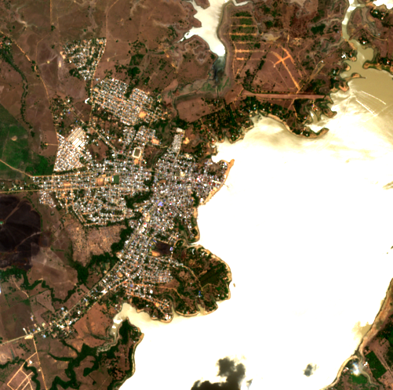
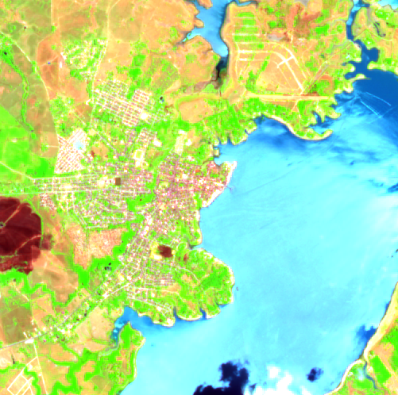
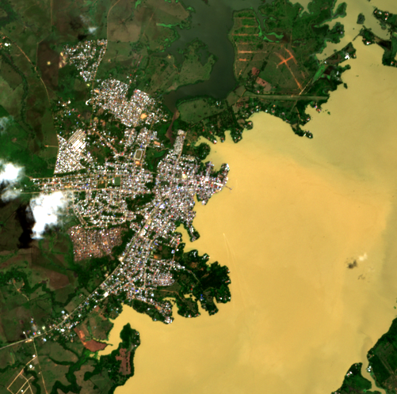
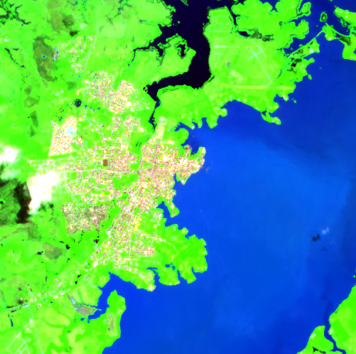
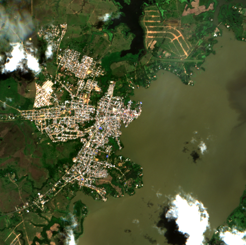
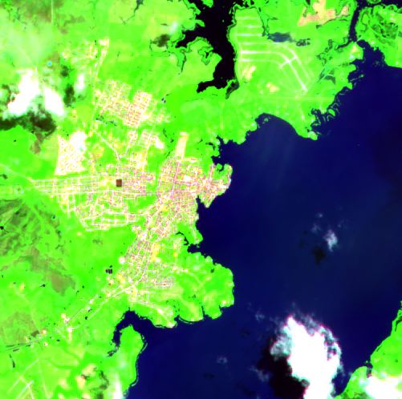

# Eval 20260508_132151

- **Backend**: anthropic API, model=claude-sonnet-4-6
- **Dataset**: data/raw/20260508_070216
- **Display name**: embedded-images smoke test
- **Samples**: 5 (4-image pair samples: RGB-pre + SWIR-pre + RGB-current + SWIR-current)
- **Started**: 2026-05-08T13:21:51.904Z
- **Finished**: 2026-05-08T13:22:02.083Z

## Accuracy by field

| field | accuracy |
|---|---|
| valid_json | 1.00 |
| fields_present | 1.00 |
| flood_present | 1.00 |
| flood_severity | 0.60 |
| water_coverage_pct_estimate | 1.00 |
| populated_area_affected | 0.80 |
| infrastructure_at_risk | 1.00 |
| river_overflow_visible | 1.00 |
| image_quality_limited | 0.60 |
| **overall** | **0.86** |
| **avg latency (s)** | **3.47** |

## Most-disagreed fields

### `flood_severity` (acc 0.60)

| sample | ground truth | prediction |
|---|---|---|
| `ayapel/cara_de_gato_2024/post` | "minor" | "severe" |
| `ayapel/cara_de_gato_2025/event` | "minor" | "moderate" |

### `image_quality_limited` (acc 0.60)

| sample | ground truth | prediction |
|---|---|---|
| `ayapel/cara_de_gato_2024/event` | true | false |
| `ayapel/cara_de_gato_2024/post` | true | false |

### `populated_area_affected` (acc 0.80)

| sample | ground truth | prediction |
|---|---|---|
| `ayapel/cara_de_gato_2025/event` | false | true |

## Worst samples (5 with the most mismatched fields)

Each sample shows the four-image input the model received: RGB-baseline, SWIR-baseline, RGB-current, SWIR-current. Compare the labeler's call (ground_truth) against the model's call (prediction).

### `ayapel/cara_de_gato_2024/post` — 2/7 fields wrong

| baseline RGB | baseline SWIR | current RGB | current SWIR |
|---|---|---|---|
|  |  |  |  |

| field | ground truth | prediction | match |
|---|---|---|---|
| `flood_present` | true | true | ✓ |
| `flood_severity` | "minor" | "severe" | ✗ |
| `water_coverage_pct_estimate` | "30-60%" | "30-60%" | ✓ |
| `populated_area_affected` | true | true | ✓ |
| `infrastructure_at_risk` | true | true | ✓ |
| `river_overflow_visible` | true | true | ✓ |
| `image_quality_limited` | true | false | ✗ |

### `ayapel/cara_de_gato_2025/event` — 2/7 fields wrong

| baseline RGB | baseline SWIR | current RGB | current SWIR |
|---|---|---|---|
|  |  |  |  |

| field | ground truth | prediction | match |
|---|---|---|---|
| `flood_present` | true | true | ✓ |
| `flood_severity` | "minor" | "moderate" | ✗ |
| `water_coverage_pct_estimate` | "30-60%" | "30-60%" | ✓ |
| `populated_area_affected` | false | true | ✗ |
| `infrastructure_at_risk` | true | true | ✓ |
| `river_overflow_visible` | true | true | ✓ |
| `image_quality_limited` | true | true | ✓ |

### `ayapel/cara_de_gato_2024/event` — 1/7 fields wrong

| baseline RGB | baseline SWIR | current RGB | current SWIR |
|---|---|---|---|
|  |  |  |  |

| field | ground truth | prediction | match |
|---|---|---|---|
| `flood_present` | true | true | ✓ |
| `flood_severity` | "moderate" | "moderate" | ✓ |
| `water_coverage_pct_estimate` | "30-60%" | "30-60%" | ✓ |
| `populated_area_affected` | true | true | ✓ |
| `infrastructure_at_risk` | true | true | ✓ |
| `river_overflow_visible` | true | true | ✓ |
| `image_quality_limited` | true | false | ✗ |

### `ayapel/cara_de_gato_2021/event` — 0/7 fields wrong

| baseline RGB | baseline SWIR | current RGB | current SWIR |
|---|---|---|---|
|  |  |  |  |

| field | ground truth | prediction | match |
|---|---|---|---|
| `flood_present` | true | true | ✓ |
| `flood_severity` | "moderate" | "moderate" | ✓ |
| `water_coverage_pct_estimate` | "30-60%" | "30-60%" | ✓ |
| `populated_area_affected` | true | true | ✓ |
| `infrastructure_at_risk` | true | true | ✓ |
| `river_overflow_visible` | true | true | ✓ |
| `image_quality_limited` | true | true | ✓ |

### `ayapel/cara_de_gato_2021/post` — 0/7 fields wrong

| baseline RGB | baseline SWIR | current RGB | current SWIR |
|---|---|---|---|
|  |  |  |  |

| field | ground truth | prediction | match |
|---|---|---|---|
| `flood_present` | true | true | ✓ |
| `flood_severity` | "moderate" | "moderate" | ✓ |
| `water_coverage_pct_estimate` | "30-60%" | "30-60%" | ✓ |
| `populated_area_affected` | true | true | ✓ |
| `infrastructure_at_risk` | true | true | ✓ |
| `river_overflow_visible` | true | true | ✓ |
| `image_quality_limited` | true | true | ✓ |
