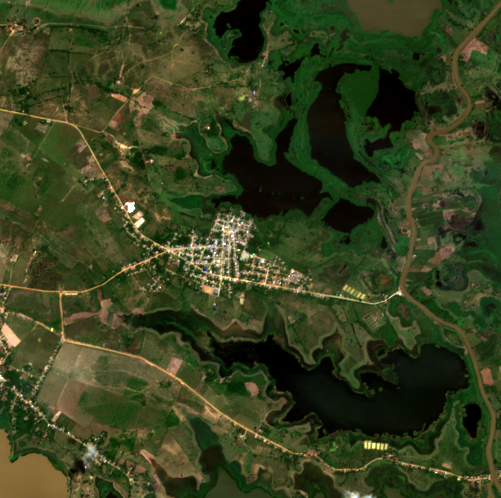
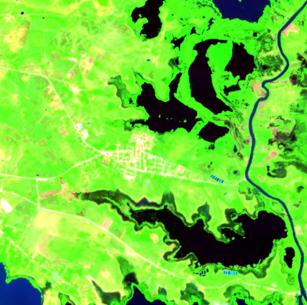
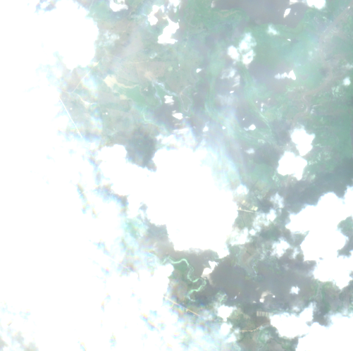
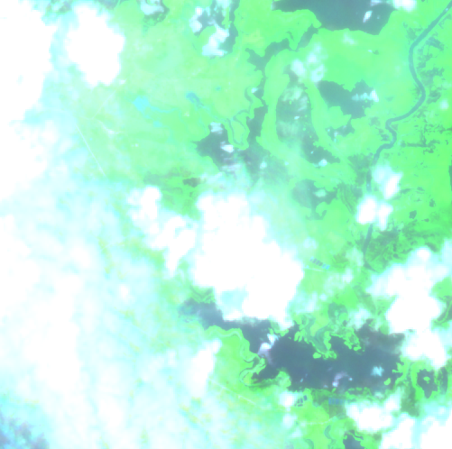
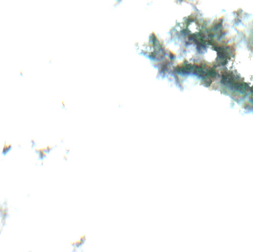
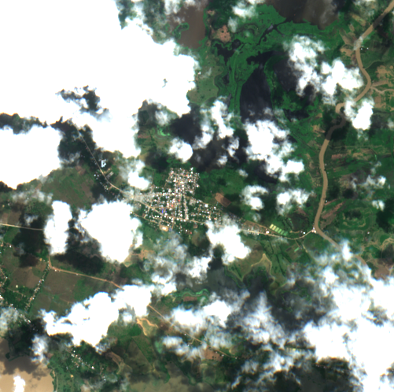
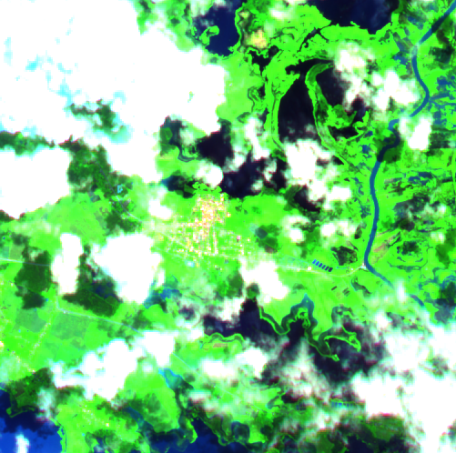

# Eval 20260508_140039

- **Backend**: llama-server at http://localhost:8765, model=lfm2-flood
- **Dataset**: data/raw/20260508_070216
- **Display name**: lfm2-flood fine-tuned (Q4_0, real mmproj)
- **Samples**: 110 (4-image pair samples: RGB-pre + SWIR-pre + RGB-current + SWIR-current)
- **Started**: 2026-05-08T14:00:39.226Z
- **Finished**: 2026-05-08T14:01:38.038Z

## Accuracy by field

| field | accuracy |
|---|---|
| valid_json | 1.00 |
| fields_present | 1.00 |
| flood_present | 0.66 |
| flood_severity | 0.29 |
| water_coverage_pct_estimate | 0.35 |
| populated_area_affected | 0.51 |
| infrastructure_at_risk | 0.54 |
| river_overflow_visible | 0.60 |
| image_quality_limited | 0.90 |
| **overall** | **0.55** |
| **avg latency (s)** | **0.53** |

## Most-disagreed fields

### `flood_severity` (acc 0.29)

| sample | ground truth | prediction |
|---|---|---|
| `ayapel/cara_de_gato_2024/post` | "minor" | "moderate" |
| `ayapel/cara_de_gato_2025/event` | "minor" | "moderate" |
| `ayapel/cara_de_gato_2025/post` | "minor" | "moderate" |
| `ayapel/la_mojana_peak_2022/event` | "none" | "moderate" |
| `ayapel/la_mojana_peak_2022/post` | "minor" | "moderate" |

### `water_coverage_pct_estimate` (acc 0.35)

| sample | ground truth | prediction |
|---|---|---|
| `ayapel/cara_de_gato_2021/event` | "30-60%" | "10-30%" |
| `ayapel/cara_de_gato_2021/post` | "30-60%" | "10-30%" |
| `ayapel/cara_de_gato_2024/event` | "30-60%" | "10-30%" |
| `ayapel/cara_de_gato_2024/post` | "30-60%" | "10-30%" |
| `ayapel/cara_de_gato_2025/event` | "30-60%" | "10-30%" |

### `populated_area_affected` (acc 0.51)

| sample | ground truth | prediction |
|---|---|---|
| `ayapel/cara_de_gato_2025/event` | false | true |
| `ayapel/la_mojana_peak_2022/event` | false | true |
| `ayapel/la_mojana_peak_2024/event` | false | true |
| `ayapel/la_mojana_peak_2024/post` | false | true |
| `ayapel/los_arrastres_2024/post` | false | true |

## Worst samples (5 with the most mismatched fields)

Each sample shows the four-image input the model received: RGB-baseline, SWIR-baseline, RGB-current, SWIR-current. Compare the labeler's call (ground_truth) against the model's call (prediction).

### `ayapel/la_mojana_peak_2022/event` — 6/7 fields wrong

| baseline RGB | baseline SWIR | current RGB | current SWIR |
|---|---|---|---|
|  |  |  |  |

| field | ground truth | prediction | match |
|---|---|---|---|
| `flood_present` | false | true | ✗ |
| `flood_severity` | "none" | "moderate" | ✗ |
| `water_coverage_pct_estimate` | "<10%" | "10-30%" | ✗ |
| `populated_area_affected` | false | true | ✗ |
| `infrastructure_at_risk` | false | true | ✗ |
| `river_overflow_visible` | false | true | ✗ |
| `image_quality_limited` | true | true | ✓ |

### `ayapel/la_mojana_peak_2024/event` — 6/7 fields wrong

| baseline RGB | baseline SWIR | current RGB | current SWIR |
|---|---|---|---|
|  |  |  |  |

| field | ground truth | prediction | match |
|---|---|---|---|
| `flood_present` | false | true | ✗ |
| `flood_severity` | "none" | "moderate" | ✗ |
| `water_coverage_pct_estimate` | "<10%" | "10-30%" | ✗ |
| `populated_area_affected` | false | true | ✗ |
| `infrastructure_at_risk` | false | true | ✗ |
| `river_overflow_visible` | false | true | ✗ |
| `image_quality_limited` | true | true | ✓ |

### `caimito/cara_de_gato_2021/post` — 6/7 fields wrong

| baseline RGB | baseline SWIR | current RGB | current SWIR |
|---|---|---|---|
|  |  |  |  |

| field | ground truth | prediction | match |
|---|---|---|---|
| `flood_present` | false | true | ✗ |
| `flood_severity` | "none" | "moderate" | ✗ |
| `water_coverage_pct_estimate` | "<10%" | "10-30%" | ✗ |
| `populated_area_affected` | false | true | ✗ |
| `infrastructure_at_risk` | false | true | ✗ |
| `river_overflow_visible` | false | true | ✗ |
| `image_quality_limited` | true | true | ✓ |

### `caimito/la_mojana_peak_2024/event` — 6/7 fields wrong

| baseline RGB | baseline SWIR | current RGB | current SWIR |
|---|---|---|---|
|  |  |  |  |

| field | ground truth | prediction | match |
|---|---|---|---|
| `flood_present` | false | true | ✗ |
| `flood_severity` | "none" | "moderate" | ✗ |
| `water_coverage_pct_estimate` | "<10%" | "10-30%" | ✗ |
| `populated_area_affected` | false | true | ✗ |
| `infrastructure_at_risk` | false | true | ✗ |
| `river_overflow_visible` | false | true | ✗ |
| `image_quality_limited` | true | true | ✓ |

### `caimito/la_mojana_peak_2024/post` — 6/7 fields wrong

| baseline RGB | baseline SWIR | current RGB | current SWIR |
|---|---|---|---|
|  |  |  |  |

| field | ground truth | prediction | match |
|---|---|---|---|
| `flood_present` | false | true | ✗ |
| `flood_severity` | "none" | "moderate" | ✗ |
| `water_coverage_pct_estimate` | "<10%" | "10-30%" | ✗ |
| `populated_area_affected` | false | true | ✗ |
| `infrastructure_at_risk` | false | true | ✗ |
| `river_overflow_visible` | false | true | ✗ |
| `image_quality_limited` | true | true | ✓ |
