# Eval comparison 20260508_132417

Comparing 4 eval run(s):

- **sonnet-4-6 oracle (pair)** — 20260508_121838 — anthropic API, model=claude-sonnet-4-6
  - Dataset: `data/raw/20260508_070216`
  - Samples: 110
  - Finished: 2026-05-08T12:20:24.579Z
- **lfm2.5-vl-450m base (Q4_0, no fine-tune)** — 20260508_122246 — llama-server at http://localhost:8765, model=lfm2.5-vl-450m-base
  - Dataset: `data/raw/20260508_070216`
  - Samples: 110
  - Finished: 2026-05-08T12:23:46.167Z
- **lfm2.5-vl-450m base (Q4_0, schema-injected)** — 20260508_123250 — llama-server at http://localhost:8765, model=lfm2.5-vl-450m-base
  - Dataset: `data/raw/20260508_070216`
  - Samples: 110
  - Finished: 2026-05-08T12:33:48.844Z
- **claude-opus-4-6 oracle (n=30)** — 20260508_123415 — anthropic API, model=claude-opus-4-6
  - Dataset: `data/raw/20260508_070216`
  - Samples: 30
  - Finished: 2026-05-08T12:34:54.837Z

## Accuracy by field

| field | sonnet-4-6 oracle (pair) | lfm2.5-vl-450m base (Q4_0, no fine-tune) | lfm2.5-vl-450m base (Q4_0, schema-injected) | claude-opus-4-6 oracle (n=30) |
|---|---|---|---|---|
| `samples` | **110** | **110** | **110** | 30 |
| `valid_json` | **1.00** | **1.00** | **1.00** | **1.00** |
| `fields_present` | **1.00** | 0.00 | **1.00** | **1.00** |
| `flood_present` | 0.66 | 0.00 | 0.66 | **0.67** |
| `flood_severity` | **0.49** | 0.00 | 0.29 | 0.43 |
| `water_coverage_pct_estimate` | 0.62 | 0.00 | 0.37 | **0.70** |
| `populated_area_affected` | 0.69 | 0.00 | 0.51 | **0.73** |
| `infrastructure_at_risk` | 0.69 | 0.00 | 0.54 | **0.73** |
| `river_overflow_visible` | 0.65 | 0.00 | 0.60 | **0.67** |
| `image_quality_limited` | **0.84** | 0.00 | 0.10 | 0.83 |
| **overall** | 0.66 | 0.00 | 0.44 | **0.68** |
| **avg_latency_s** | 3.74 | 0.55 | **0.53** | 3.87 |

(**bold** = best value in each row.)

## Sample-level disagreements

Samples where two or more runs produced different predictions for the same ground-truth tile. Only samples present in **all** compared runs are shown. The four images are the model's input — RGB-baseline, SWIR-baseline, RGB-current, SWIR-current. Each row's cell shows that run's prediction.

30 samples common to all runs.

30 samples where runs disagreed on at least one field.

### `ayapel/cara_de_gato_2021/event` — 7/7 fields disagreed

| baseline RGB | baseline SWIR | current RGB | current SWIR |
|---|---|---|---|
|  |  | 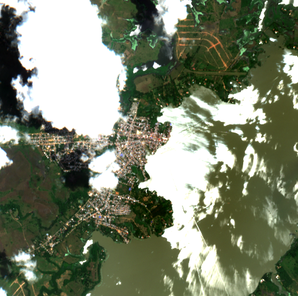 | 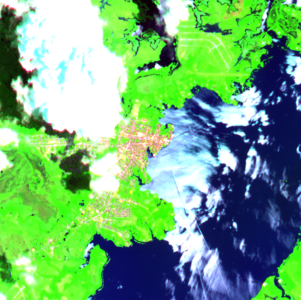 |

| field | ground truth | sonnet-4-6 oracle (pair) | lfm2.5-vl-450m base (Q4_0, no fine-tune) | lfm2.5-vl-450m base (Q4_0, schema-injected) | claude-opus-4-6 oracle (n=30) |
|---|---|---|---|---|---|
| **`flood_present`** | true | true ✓ | undefined ✗ | true ✓ | false ✗ |
| **`flood_severity`** | "moderate" | "moderate" ✓ | undefined ✗ | "moderate" ✓ | "none" ✗ |
| **`water_coverage_pct_estimate`** | "30-60%" | "30-60%" ✓ | undefined ✗ | "30-60%" ✓ | "30-60%" ✓ |
| **`populated_area_affected`** | true | true ✓ | undefined ✗ | true ✓ | false ✗ |
| **`infrastructure_at_risk`** | true | true ✓ | undefined ✗ | true ✓ | false ✗ |
| **`river_overflow_visible`** | true | true ✓ | undefined ✗ | true ✓ | false ✗ |
| **`image_quality_limited`** | true | true ✓ | undefined ✗ | false ✗ | true ✓ |

### `ayapel/cara_de_gato_2021/post` — 7/7 fields disagreed

| baseline RGB | baseline SWIR | current RGB | current SWIR |
|---|---|---|---|
|  |  | 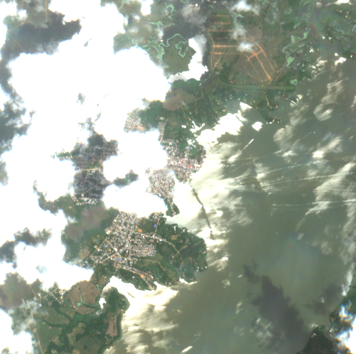 | 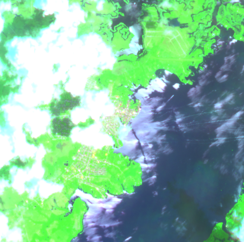 |

| field | ground truth | sonnet-4-6 oracle (pair) | lfm2.5-vl-450m base (Q4_0, no fine-tune) | lfm2.5-vl-450m base (Q4_0, schema-injected) | claude-opus-4-6 oracle (n=30) |
|---|---|---|---|---|---|
| **`flood_present`** | true | true ✓ | undefined ✗ | true ✓ | false ✗ |
| **`flood_severity`** | "moderate" | "moderate" ✓ | undefined ✗ | "moderate" ✓ | "none" ✗ |
| **`water_coverage_pct_estimate`** | "30-60%" | "30-60%" ✓ | undefined ✗ | "30-60%" ✓ | "30-60%" ✓ |
| **`populated_area_affected`** | true | true ✓ | undefined ✗ | true ✓ | false ✗ |
| **`infrastructure_at_risk`** | true | true ✓ | undefined ✗ | true ✓ | false ✗ |
| **`river_overflow_visible`** | true | true ✓ | undefined ✗ | true ✓ | false ✗ |
| **`image_quality_limited`** | true | true ✓ | undefined ✗ | false ✗ | true ✓ |

### `ayapel/cara_de_gato_2024/event` — 7/7 fields disagreed

| baseline RGB | baseline SWIR | current RGB | current SWIR |
|---|---|---|---|
|  |  | 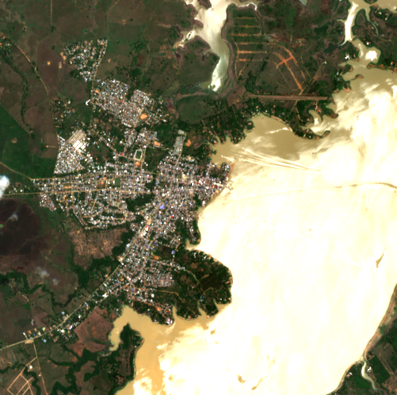 | 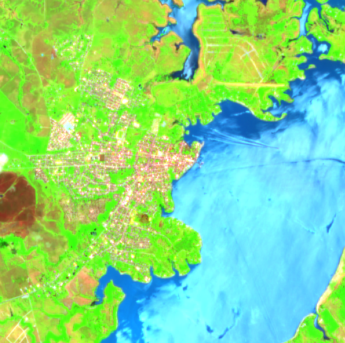 |

| field | ground truth | sonnet-4-6 oracle (pair) | lfm2.5-vl-450m base (Q4_0, no fine-tune) | lfm2.5-vl-450m base (Q4_0, schema-injected) | claude-opus-4-6 oracle (n=30) |
|---|---|---|---|---|---|
| **`flood_present`** | true | true ✓ | undefined ✗ | true ✓ | true ✓ |
| **`flood_severity`** | "moderate" | "moderate" ✓ | undefined ✗ | "moderate" ✓ | "moderate" ✓ |
| **`water_coverage_pct_estimate`** | "30-60%" | "30-60%" ✓ | undefined ✗ | "30-60%" ✓ | "30-60%" ✓ |
| **`populated_area_affected`** | true | true ✓ | undefined ✗ | true ✓ | true ✓ |
| **`infrastructure_at_risk`** | true | true ✓ | undefined ✗ | true ✓ | true ✓ |
| **`river_overflow_visible`** | true | true ✓ | undefined ✗ | true ✓ | true ✓ |
| **`image_quality_limited`** | true | false ✗ | undefined ✗ | false ✗ | false ✗ |

### `ayapel/cara_de_gato_2024/post` — 7/7 fields disagreed

| baseline RGB | baseline SWIR | current RGB | current SWIR |
|---|---|---|---|
|  |  | 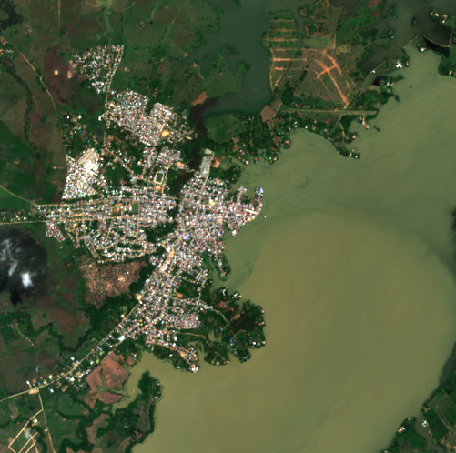 | 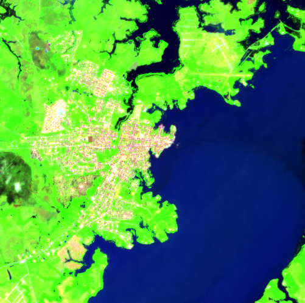 |

| field | ground truth | sonnet-4-6 oracle (pair) | lfm2.5-vl-450m base (Q4_0, no fine-tune) | lfm2.5-vl-450m base (Q4_0, schema-injected) | claude-opus-4-6 oracle (n=30) |
|---|---|---|---|---|---|
| **`flood_present`** | true | true ✓ | undefined ✗ | true ✓ | true ✓ |
| **`flood_severity`** | "minor" | "moderate" ✗ | undefined ✗ | "moderate" ✗ | "moderate" ✗ |
| **`water_coverage_pct_estimate`** | "30-60%" | "30-60%" ✓ | undefined ✗ | "30-60%" ✓ | "30-60%" ✓ |
| **`populated_area_affected`** | true | true ✓ | undefined ✗ | true ✓ | true ✓ |
| **`infrastructure_at_risk`** | true | true ✓ | undefined ✗ | true ✓ | true ✓ |
| **`river_overflow_visible`** | true | true ✓ | undefined ✗ | true ✓ | true ✓ |
| **`image_quality_limited`** | true | false ✗ | undefined ✗ | false ✗ | false ✗ |

### `ayapel/cara_de_gato_2025/event` — 7/7 fields disagreed

| baseline RGB | baseline SWIR | current RGB | current SWIR |
|---|---|---|---|
|  |  | 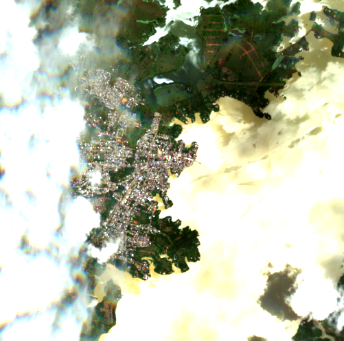 | 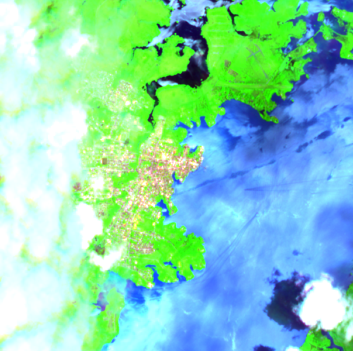 |

| field | ground truth | sonnet-4-6 oracle (pair) | lfm2.5-vl-450m base (Q4_0, no fine-tune) | lfm2.5-vl-450m base (Q4_0, schema-injected) | claude-opus-4-6 oracle (n=30) |
|---|---|---|---|---|---|
| **`flood_present`** | true | false ✗ | undefined ✗ | true ✓ | false ✗ |
| **`flood_severity`** | "minor" | "none" ✗ | undefined ✗ | "moderate" ✗ | "none" ✗ |
| **`water_coverage_pct_estimate`** | "30-60%" | "30-60%" ✓ | undefined ✗ | "30-60%" ✓ | "30-60%" ✓ |
| **`populated_area_affected`** | false | false ✓ | undefined ✗ | true ✗ | false ✓ |
| **`infrastructure_at_risk`** | true | false ✗ | undefined ✗ | true ✓ | false ✗ |
| **`river_overflow_visible`** | true | false ✗ | undefined ✗ | true ✓ | false ✗ |
| **`image_quality_limited`** | true | true ✓ | undefined ✗ | false ✗ | true ✓ |

### `ayapel/cara_de_gato_2025/post` — 7/7 fields disagreed

| baseline RGB | baseline SWIR | current RGB | current SWIR |
|---|---|---|---|
|  |  | 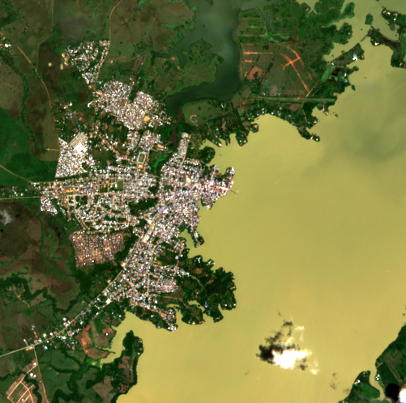 | 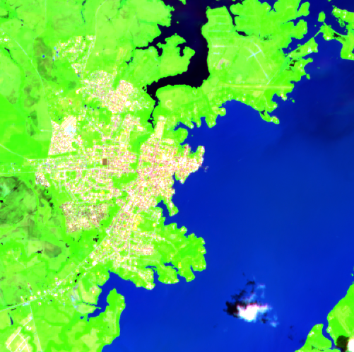 |

| field | ground truth | sonnet-4-6 oracle (pair) | lfm2.5-vl-450m base (Q4_0, no fine-tune) | lfm2.5-vl-450m base (Q4_0, schema-injected) | claude-opus-4-6 oracle (n=30) |
|---|---|---|---|---|---|
| **`flood_present`** | true | false ✗ | undefined ✗ | true ✓ | false ✗ |
| **`flood_severity`** | "minor" | "none" ✗ | undefined ✗ | "moderate" ✗ | "none" ✗ |
| **`water_coverage_pct_estimate`** | "30-60%" | "30-60%" ✓ | undefined ✗ | "30-60%" ✓ | "30-60%" ✓ |
| **`populated_area_affected`** | true | false ✗ | undefined ✗ | true ✓ | false ✗ |
| **`infrastructure_at_risk`** | true | false ✗ | undefined ✗ | true ✓ | false ✗ |
| **`river_overflow_visible`** | true | false ✗ | undefined ✗ | true ✓ | false ✗ |
| **`image_quality_limited`** | true | false ✗ | undefined ✗ | false ✗ | false ✗ |

### `ayapel/la_mojana_peak_2022/event` — 7/7 fields disagreed

| baseline RGB | baseline SWIR | current RGB | current SWIR |
|---|---|---|---|
| 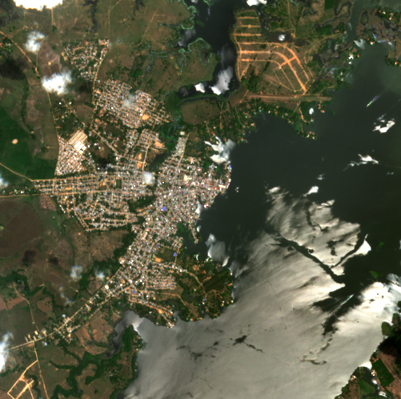 | 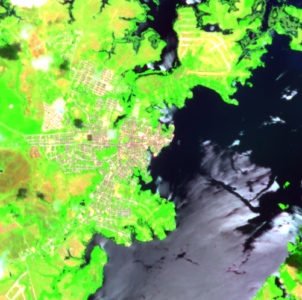 |  |  |

| field | ground truth | sonnet-4-6 oracle (pair) | lfm2.5-vl-450m base (Q4_0, no fine-tune) | lfm2.5-vl-450m base (Q4_0, schema-injected) | claude-opus-4-6 oracle (n=30) |
|---|---|---|---|---|---|
| **`flood_present`** | false | false ✓ | undefined ✗ | true ✗ | false ✓ |
| **`flood_severity`** | "none" | "none" ✓ | undefined ✗ | "moderate" ✗ | "none" ✓ |
| **`water_coverage_pct_estimate`** | "<10%" | "<10%" ✓ | undefined ✗ | "10-30%" ✗ | "<10%" ✓ |
| **`populated_area_affected`** | false | false ✓ | undefined ✗ | true ✗ | false ✓ |
| **`infrastructure_at_risk`** | false | false ✓ | undefined ✗ | true ✗ | false ✓ |
| **`river_overflow_visible`** | false | false ✓ | undefined ✗ | true ✗ | false ✓ |
| **`image_quality_limited`** | true | true ✓ | undefined ✗ | false ✗ | true ✓ |

### `ayapel/la_mojana_peak_2022/post` — 7/7 fields disagreed

| baseline RGB | baseline SWIR | current RGB | current SWIR |
|---|---|---|---|
|  |  | 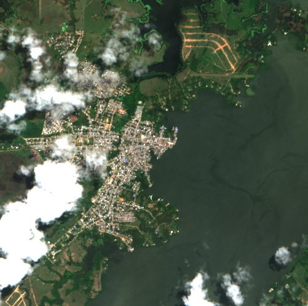 | 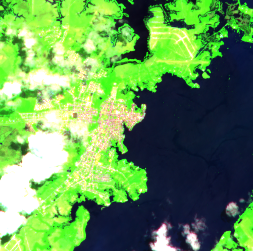 |

| field | ground truth | sonnet-4-6 oracle (pair) | lfm2.5-vl-450m base (Q4_0, no fine-tune) | lfm2.5-vl-450m base (Q4_0, schema-injected) | claude-opus-4-6 oracle (n=30) |
|---|---|---|---|---|---|
| **`flood_present`** | true | false ✗ | undefined ✗ | true ✓ | true ✓ |
| **`flood_severity`** | "minor" | "none" ✗ | undefined ✗ | "moderate" ✗ | "moderate" ✗ |
| **`water_coverage_pct_estimate`** | "30-60%" | "10-30%" ✗ | undefined ✗ | "30-60%" ✓ | "30-60%" ✓ |
| **`populated_area_affected`** | true | false ✗ | undefined ✗ | true ✓ | true ✓ |
| **`infrastructure_at_risk`** | true | false ✗ | undefined ✗ | true ✓ | true ✓ |
| **`river_overflow_visible`** | true | false ✗ | undefined ✗ | true ✓ | true ✓ |
| **`image_quality_limited`** | true | true ✓ | undefined ✗ | false ✗ | true ✓ |

### `ayapel/la_mojana_peak_2024/event` — 7/7 fields disagreed

| baseline RGB | baseline SWIR | current RGB | current SWIR |
|---|---|---|---|
|  |  |  |  |

| field | ground truth | sonnet-4-6 oracle (pair) | lfm2.5-vl-450m base (Q4_0, no fine-tune) | lfm2.5-vl-450m base (Q4_0, schema-injected) | claude-opus-4-6 oracle (n=30) |
|---|---|---|---|---|---|
| **`flood_present`** | false | false ✓ | undefined ✗ | true ✗ | false ✓ |
| **`flood_severity`** | "none" | "none" ✓ | undefined ✗ | "moderate" ✗ | "none" ✓ |
| **`water_coverage_pct_estimate`** | "<10%" | "<10%" ✓ | undefined ✗ | "10-30%" ✗ | "<10%" ✓ |
| **`populated_area_affected`** | false | false ✓ | undefined ✗ | true ✗ | false ✓ |
| **`infrastructure_at_risk`** | false | false ✓ | undefined ✗ | true ✗ | false ✓ |
| **`river_overflow_visible`** | false | false ✓ | undefined ✗ | true ✗ | false ✓ |
| **`image_quality_limited`** | true | true ✓ | undefined ✗ | false ✗ | true ✓ |

### `ayapel/la_mojana_peak_2024/post` — 7/7 fields disagreed

| baseline RGB | baseline SWIR | current RGB | current SWIR |
|---|---|---|---|
|  |  |  |  |

| field | ground truth | sonnet-4-6 oracle (pair) | lfm2.5-vl-450m base (Q4_0, no fine-tune) | lfm2.5-vl-450m base (Q4_0, schema-injected) | claude-opus-4-6 oracle (n=30) |
|---|---|---|---|---|---|
| **`flood_present`** | true | true ✓ | undefined ✗ | true ✓ | false ✗ |
| **`flood_severity`** | "minor" | "moderate" ✗ | undefined ✗ | "moderate" ✗ | "none" ✗ |
| **`water_coverage_pct_estimate`** | "<10%" | "10-30%" ✗ | undefined ✗ | "10-30%" ✗ | "10-30%" ✗ |
| **`populated_area_affected`** | false | false ✓ | undefined ✗ | true ✗ | false ✓ |
| **`infrastructure_at_risk`** | false | false ✓ | undefined ✗ | true ✗ | false ✓ |
| **`river_overflow_visible`** | false | true ✗ | undefined ✗ | true ✗ | false ✓ |
| **`image_quality_limited`** | true | true ✓ | undefined ✗ | false ✗ | true ✓ |
