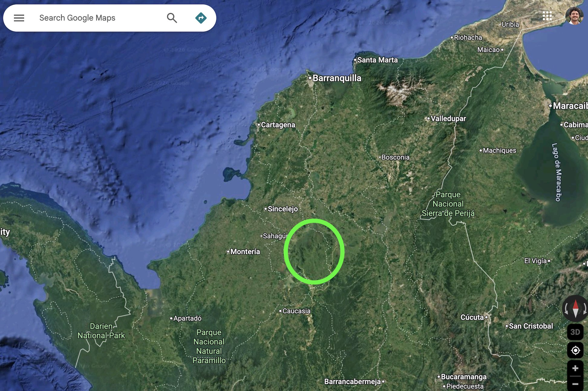
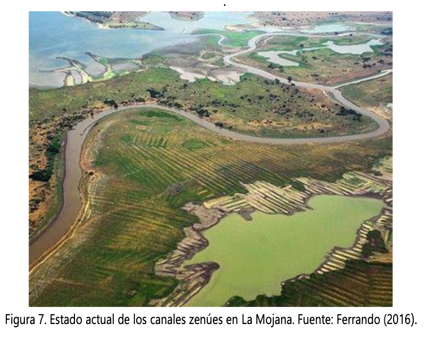
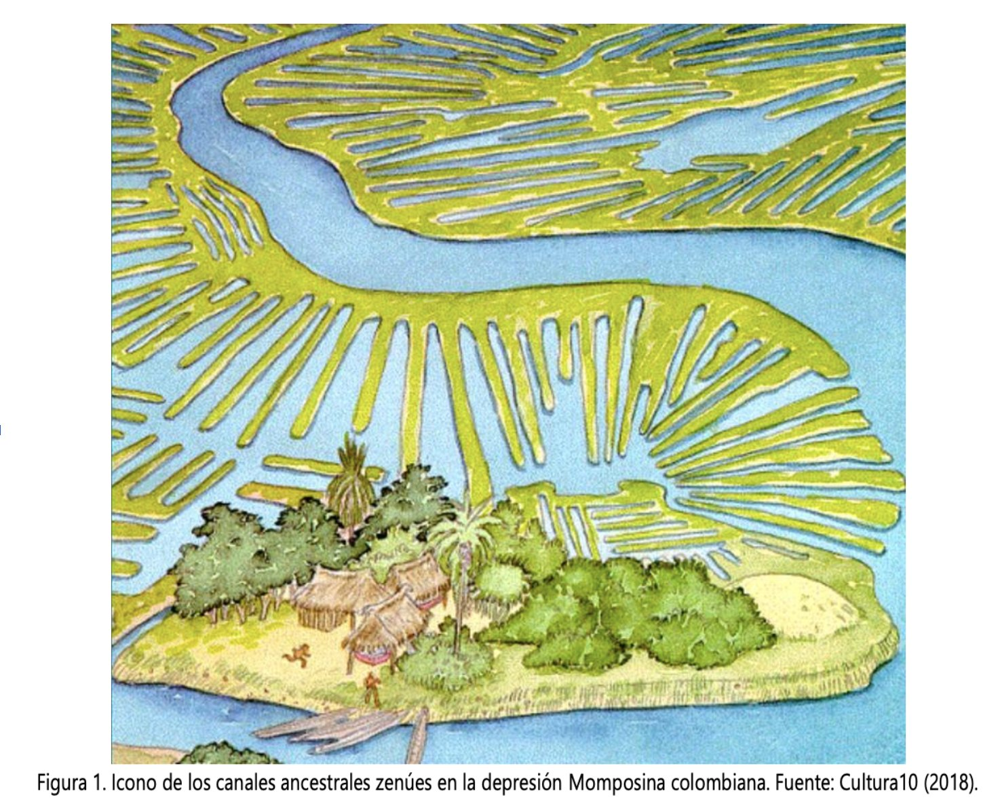
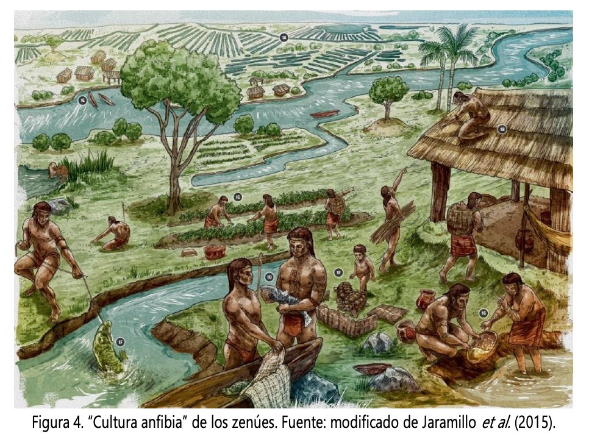

# The Zenú already solved this — once

This is **La Mojana** — a 500,000-hectare wetland in northern Colombia where the Cauca, San Jorge and Magdalena rivers meet. I started tracking the floods here from above, after watching the same families lose their homes year after year to the same dike breaking in the same place.

What gets forgotten in the policy documents is that **this place was civilised**. For roughly 2,000 years before the Spanish arrived, La Mojana was home to the **Zenú**, who built one of the most advanced hydraulic engineering systems in the pre-Columbian Americas:

- Networks of **canals and camellones** (raised cultivation platforms) covering more than **500,000 hectares** — visible from satellites today as faint herringbone patterns under farmland.
- The system **embraced** the seasonal floods rather than fighting them. It moved water *through* the landscape during the wet season and stored it *in* the landscape during the dry one.
- It supported a population estimated in the **hundreds of thousands** — denser than today.

Then European contact, depopulation, and centuries of neglect collapsed the system. The canals silted up. The drainage logic was forgotten. By the 20th century, the response to floods had inverted: **build dikes that try to keep water out** instead of channels that move it through. The Cara de Gato dike in San Jacinto del Cauca, Bolívar, is the symbol of that reversal — it has broken in **2021, 2024, and 2025**, displacing hundreds of thousands of people each cycle.

## So this is the question

The Zenú had no satellites, no smartphones, no internet, no Sentinel-1 SAR. They had landscape literacy, accumulated knowledge, and a system designed for the floods they actually got.

We have the satellites and the smartphones and the SAR. **What we don't have is a way to deliver that knowledge to the people in the wetland in the moment they need it.**

humaid is one attempt to close that loop — to use modern technology not to fight the water, but to make the *knowledge about the water* finally reach the people who live with it.

---

*Sources: research/water-crisis-colombia.md, IISD wetland restoration analysis (research/download-md/IISD-Restoring-Wetlands-La-Mojana.md), Adaptation Fund "Reducing Risk and Vulnerability to Climate Change in La Depresión Momposina."*
